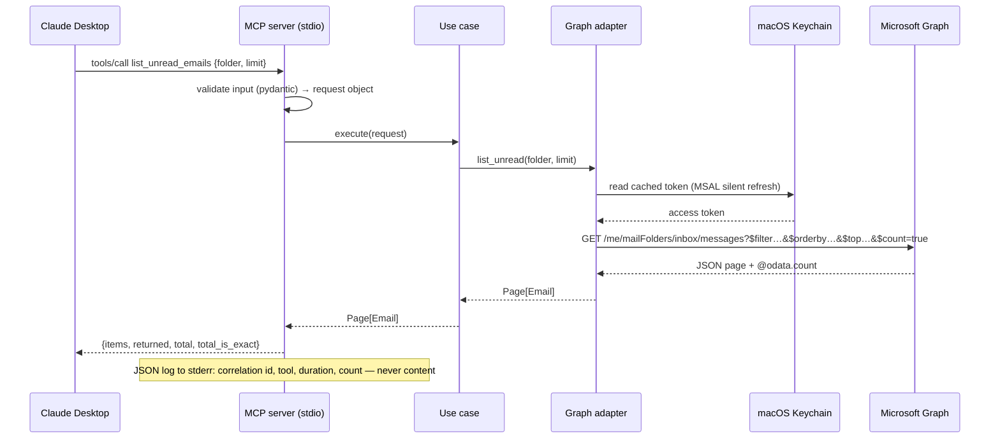

# outlook-mac-mcp

<!-- mcp-name: io.github.valter-araujo/outlook-mac-mcp -->

MCP server for Microsoft Outlook, built for **personal Microsoft accounts**
(Hotmail, Outlook.com, Live) that run on the consumer infrastructure rather than
Exchange Online — and are therefore not supported by the official
"Claude for Outlook" add-in nor by the Microsoft 365 connector.

Backend: **Microsoft Graph API** with delegated, user-consented, least-privilege scopes.
Python, transport `stdio`, no telemetry.

## Why not AppleScript

Community MCP servers for Outlook on Mac drive the app through AppleScript. That
path only works with **Legacy Outlook**. In August 2026 Microsoft cancelled the
planned AppleScript support in New Outlook, and the transition to New Outlook
ends in October 2026. This project deliberately does not depend on it.

The reference environment for this project runs **New Outlook** (the
"Legacy Outlook" toggle is present in the Outlook menu), where AppleScript
automation is unavailable. This was the deciding factor.

## Technical requirements

### Runtime

| Component | Requirement | Notes |
|---|---|---|
| macOS | 13 Ventura or later | Keychain used for token storage |
| Python | 3.12+ | Managed with `uv`; dependencies pinned in `uv.lock` |
| MCP client | Any stdio client (Claude Desktop, Claude Code) | Tested against Claude Desktop |
| Network | HTTPS to `login.microsoftonline.com` and `graph.microsoft.com` only | No other outbound calls |

### Microsoft account and app registration

| Item | Requirement |
|---|---|
| Account type | Personal Microsoft account (Hotmail / Outlook.com / Live) or work/school |
| App registration | One-time registration in Microsoft Entra ID (free; a personal account needs its own tenant, created via the Azure Portal) |
| Supported account types | **"Accounts in any organizational directory and personal Microsoft accounts"** |
| Authentication | Device-code flow (MSAL, public client, **no client secret**) |
| Authority | `https://login.microsoftonline.com/consumers` |
| Scopes requested by default | `Mail.Read`, `Calendars.Read`, `Contacts.Read`, `offline_access`, `User.Read` |
| Scope added by `OUTLOOK_MCP_ENABLE_CALENDAR_WRITE=true` | `Calendars.ReadWrite` (see [Optional: calendar write](#optional-calendar-write)) |
| Admin consent | Not required — every scope above is user-consentable |

`offline_access`, `openid` and `profile` are reserved scopes: MSAL appends them
to every request on its own and raises if they are passed explicitly. They are
consented at the registration but never appear in the list the code asks for —
that consent is what yields the refresh token behind the Keychain cache.

The app registration may list broader permissions than the server requests. The
token only ever carries the scopes the running configuration asks for: the write
scope is requested only behind a config flag that is off by default, and turning it
on triggers a new sign-in and consent prompt.

### Not required

- Microsoft Outlook desktop app (the server talks to Graph, not to the app)
- Exchange Online / Microsoft 365 business tenant
- Accessibility or Automation permissions on macOS
- Node.js, Bun, or any non-Python runtime

## Validated environments

Ordered chronologically by validation date (oldest first).

| Version | OS | Python | MCP client | Account type | Outlook app installed | Status |
|---|---|---|---|---|---|---|
| 0.1.0 | macOS 27.0 (Golden Gate), Apple M5 | 3.14.7 | Claude Desktop | Personal (`@hotmail.com`) | Outlook for Mac 16.112.4 (26090911), New Outlook, M365 Subscription — not used by the server | **validated** 2026-09-14 |
| 0.2.0 (calendar write on) | macOS 27.0 (Golden Gate), Apple M5 | 3.14.7 | Claude Desktop | Personal (`@hotmail.com`) | as above | **validated** 2026-09-15 |
| 0.5.0 (update_event) | macOS 27.0 (Golden Gate), Apple M5 | 3.14.7 | Claude Desktop | Personal (`@hotmail.com`) | as above | **validated** 2026-09-17 |

A row moves to **validated** only after the tools it names return correct results on
that environment, against a real mailbox. Contributions of new rows are welcome — please
include exact versions.

### Validated tools

Sorted alphabetically by tool name.

| Tool | Validated | What was checked |
|---|---|---|
| `count_emails` | 2026-09-15 | A received-time range covering one month returned an exact count. |
| `create_event` | 2026-09-15, 2026-09-16, 2026-09-17 | Created a timed event and an all-day event; Graph accepted the all-day payload with the resolved zone's name, and both came back readable. A body from the preview was written to the created event correctly. An event with no body at all also succeeded, confirming the fix for Graph defaulting an unsent body to HTML. |
| `get_email` | 2026-09-14 | Text body returned with the `Prefer` header honoured; the malformed id `nope` came back as `ErrorInvalidIdMalformed` and was mapped to `InvalidRequestError`. |
| `list_emails` | 2026-09-15 | `sort=oldest`, `limit=1` returned the folder's earliest email with an exact total; an exact-sender filter with `sort=newest` returned exactly one match, and Graph accepted the sender filter combined with `$orderby` without an `InefficientFilter` error. |
| `list_folders` | 2026-09-17 | Discovered 100+ custom folders correctly, including several levels of nesting, each with accurate per-folder unread/total counts. Confirmed the documented limitation live: a Microsoft-managed folder with no well-known flag (Deleted Items) appeared in `custom` as expected, alongside genuine user-created folders. |
| `list_largest_emails` | 2026-09-16 | Returned ranked results with real sizes from the extended property, `skipped` near zero. |
| `list_todays_events` | 2026-09-15 | Returned zero events, exact, on a free day. |
| `list_unread_emails` | 2026-09-14 | Reads a Hotmail inbox through Graph. |
| `list_upcoming_events` | 2026-09-15 | Returned the matching events, earliest first; confirmed both an all-day event and a timed event mapped correctly in the resolved time zone. |
| `preview_event` | 2026-09-15, 2026-09-16 | Summary and token for a timed and an all-day event; a body well under the truncation threshold showed in full, verbatim, in the preview. |
| `preview_event_update` | 2026-09-17 | A time change (10:00–10:30 -> 11:00–11:30) produced a diff summary showing only the changed field, old value -> new value. |
| `search_emails` | 2026-09-14, 2026-09-15, 2026-09-17 | A term matching several emails returned an exact total; `scope=subject` and `scope=sender` each returned a narrower, still-exact subset; a term trying to break out of the phrase returned empty with no 400. Passing `next_page_token` back as `page_token` returned a genuinely different second page (a different date window, no items repeated from the first), with `total`/`total_is_exact` still accurate on that page. |
| `top_senders` | 2026-09-15 | A full inbox scan hit the configured ceiling with `coverage_is_complete=false`; the client reported the partial coverage explicitly, as the description asks. |
| `update_event` | 2026-09-17 | Applied the previewed time change (10:00–10:30 -> 11:00–11:30) exactly; the updated event reflected only that change. |

Every tool shipped so far has been validated against a real mailbox on the environment
above. Search quoting is additionally covered by a live positive-control check, see
[Integration tests](#integration-tests).

## Scope

- **v1 (read-only):** unread emails, emails by folder, search by term, read one
  email by id (body included), list folders, today's / upcoming events, contact
  search.
- **v2:** create and update calendar events — behind a config flag, off by
  default; delete calendar events — behind a second flag, off by default even
  when the first one is on; mark as read — not yet built.
- **v3:** send email — behind a config flag, off by default, with explicit
  per-call confirmation.

## Tools

Read tools are always registered. The four tools marked `v2, flagged` register only
when `OUTLOOK_MCP_ENABLE_CALENDAR_WRITE=true` (see
[Optional: calendar write](#optional-calendar-write)). `preview_event_deletion` and
`delete_event`, marked `v2, flagged + calendar delete`, additionally need
`OUTLOOK_MCP_ENABLE_CALENDAR_DELETE=true` (see
[Optional: calendar delete](#optional-calendar-delete)). Sorted alphabetically by tool name.

| Tool | What it does |
|---|---|
| `count_emails` | Count emails matching the same filters as `list_emails`, exactly, without listing them. |
| `create_event` (v2, flagged) | Create the event previewed under a token from `preview_event`. |
| `delete_event` (v2, flagged + calendar delete) | Delete the event previewed under a token from `preview_event_deletion`. Irreversible. |
| `get_email` | Fetch one email by id, body included. |
| `list_emails` | List emails in a folder with any combination of filters (read state, sender, date range, attachments), sorted newest or oldest, with an exact total. |
| `list_folders` | List the mailbox's well-known folders with their unread and total item counts, plus every user-created folder found by walking the mailbox tree, each identified by its full path. |
| `list_largest_emails` | List a folder's largest emails by byte size, largest first, scanning up to 10,000 matching emails per call; emails with no determinable size are counted separately in `skipped`. |
| `list_todays_events` | List today's calendar events, earliest first. |
| `list_unread_emails` | List unread emails in a folder, newest first. |
| `list_upcoming_events` | List calendar events from now through 1–30 days ahead. |
| `preview_event` (v2, flagged) | Validate a new event and return a token and a summary, without creating it. |
| `preview_event_deletion` (v2, flagged + calendar delete) | Fetch an existing event and return a token and a summary showing every field, unabbreviated, without deleting anything. |
| `preview_event_update` (v2, flagged) | Fetch an existing event, validate the requested changes, and return a token and a diff summary (old value -> new value, changed fields only), without applying anything. |
| `search_contacts` | Search contacts by a display-name prefix or an exact email address. |
| `search_emails` | Search a folder for a term, ranked by relevance, not by date. |
| `top_senders` | Rank a folder's senders by how many emails each sent, scanning up to 10,000 matching emails per call. |
| `update_event` (v2, flagged) | Apply the change previewed under a token from `preview_event_update`. Only the fields actually passed to the preview are changed. |

## Security model

- Least privilege: the token can only do what the requested scopes allow, even
  if the server process is compromised.
- Tokens are stored in the macOS Keychain, never in files or environment
  variables.
- Email content is treated as untrusted input. The server never acts on
  instructions found inside message bodies.
- Structured JSON logs go to `stderr` (stdout is the MCP transport). Logs
  contain metadata and counts only — never subjects, bodies, addresses, or
  contact names.

## Architecture

```
domain/           entities and rules — no Graph, no MCP
application/      use cases depending on ports (interfaces)
infrastructure/   Graph API adapter — the only place that knows Microsoft
interface/mcp/    tool registration and input/output translation only
```

Dependencies point inward. Swapping the backend touches `infrastructure/` only.

## Architecture at a glance

Dependencies point inward. The Graph adapters implement most ports; the one exception
is `Clock`, implemented by `SystemClock`, which lives outside `infrastructure/graph`
since it never talks to Microsoft. Nothing in `domain/` or `application/` imports either.

```mermaid
flowchart TB
    subgraph interface["interface/mcp — translation only"]
        tools["MCP tools<br/>pydantic input · flat output views"]
    end
    subgraph application["application — use cases"]
        uc["ListUnreadEmails · SearchEmails · GetEmail<br/>ListEmails · CountEmails · TopSenders · ListLargestEmails<br/>ListTodaysEvents · ListUpcomingEvents<br/>PreviewEvent · CreateEvent<br/>PreviewEventUpdate · UpdateEvent<br/>PreviewEventDeletion · DeleteEvent<br/>ListFolders · SearchContacts"]
        ports["Ports (Protocol)<br/>MailRepository · CalendarRepository · CalendarWriter<br/>ContactRepository · MailFolderRepository · Clock"]
    end
    subgraph domain["domain — entities and rules"]
        ent["Email · Event · Contact · Page · TimeWindow<br/>frozen dataclasses · no Graph, no MCP"]
    end
    subgraph infra["infrastructure/graph — the only place that knows Microsoft"]
        adapters["Graph adapters<br/>query builders · JSON→entity mappers"]
        auth["MSAL device-code<br/>token cache in macOS Keychain"]
        http["httpx client<br/>host-pinned to graph.microsoft.com"]
    end
    clock["infrastructure/system_clock<br/>SystemClock — reads the resolved time zone"]
    tools --> uc
    uc --> ports
    uc --> ent
    adapters -. implements .-> ports
    clock -. implements .-> ports
    adapters --> http
    http --> auth
```

One read call end to end. Input is validated before it becomes a query; logs carry
metadata and counts, never content.



## Development

```
uv sync
uv run ruff check .
uv run ruff format --check .
uv run mypy
uv run pytest
```

### Integration tests

Tests marked `@pytest.mark.integration` reach the real Microsoft Graph API and are
deselected by default. They need a completed sign-in (see
[Installation](#3-sign-in-once)) and the client id in the environment:

```
export OUTLOOK_MCP_CLIENT_ID=<your client id>
uv run pytest -m integration
```

They read the signed-in mailbox but never write to it, and they provision their own
fixtures: no particular message has to exist, and a test skips rather than fails if the
mailbox yields nothing to work with.

One of them is load-bearing rather than incidental. `test_search_query_live.py` checks
that Graph parses a search term as literal text instead of as a query, by sending the
same string in the safe form and in the form this project used to send, and comparing
result counts against a sender taken from the mailbox itself. A unit test cannot show
this: it can only assert the bytes we send, and every unit test passed while terms were
in fact being executed as queries. Run it after touching anything about how a query is
quoted, escaped or encoded.

## Installation

### 1. Register the app in Microsoft Entra ID

Follow the table under [Microsoft account and app registration](#microsoft-account-and-app-registration).
Note the **Application (client) ID** — it is not a secret, but it identifies your
registration and does not belong in this repository.

### 2. Install

```sh
git clone https://github.com/valter-araujo/outlook-mac-mcp.git
cd outlook-mac-mcp
uv sync
```

### 3. Sign in once

The MCP server never starts a sign-in of its own: the device-code flow blocks for
minutes waiting for a browser, and a stdio server has nowhere to show the code,
because stdout carries the MCP protocol. Authenticate out of band instead:

```sh
export OUTLOOK_MCP_CLIENT_ID=<your client id>
uv run outlook-mac-mcp sign-in
```

The code and the URL are printed to stderr. Open the URL, enter the code, and approve
the requested scopes. The resulting token is stored in the macOS Keychain under the
service `outlook-mac-mcp`; it is never written to a file or an environment variable.

Repeat this only when the refresh token expires or you revoke consent.

### 4. Point Claude Desktop at the server

Edit `~/Library/Application Support/Claude/claude_desktop_config.json`:

```json
{
  "mcpServers": {
    "outlook-mac-mcp": {
      "command": "uv",
      "args": ["--directory", "/absolute/path/to/outlook-mac-mcp", "run", "outlook-mac-mcp"],
      "env": {
        "OUTLOOK_MCP_CLIENT_ID": "<your client id>"
      }
    }
  }
}
```

Three things this configuration has to get right:

- **`OUTLOOK_MCP_CLIENT_ID` must be in the `env` block.** Claude Desktop launches the
  server as a GUI process, which does not inherit your shell environment: an `export` in
  `~/.zshrc` is invisible to it. The `env` block is the only thing the server sees.
- **Use an absolute path** in `--directory`. The launched process does not start in your
  project directory.
- **`uv` must be on the launcher's `PATH`,** which is likewise not your shell's. If the
  server fails to start, replace `"command": "uv"` with the absolute path from
  `which uv` (typically `~/.local/bin/uv`).

Restart Claude Desktop. `list_unread_emails` and the other read tools should appear in
the tool list; the four create/update tools appear only with the write flag on, and
`preview_event_deletion`/`delete_event` need the delete flag on top of that (see
[Optional: calendar delete](#optional-calendar-delete)).

### Optional: log level

`OUTLOOK_MCP_LOG_LEVEL` sets the verbosity (default `INFO`). Structured JSON logs go to
stderr and carry metadata only — tool name, correlation id, duration, outcome and item
count, never subjects, addresses or bodies. Add it to the same `env` block.

### Optional: time zone

Calendar tools express every time in one zone and decide what "today" means from it.
By default that is the machine's time zone, as reported by the operating system. To
override it, add `OUTLOOK_MCP_TIMEZONE` with an IANA name (for example
`America/Sao_Paulo` or `Europe/Lisbon`) to the same `env` block. The name is validated
at startup: an unknown one stops both the server and `sign-in` with a
`ConfigurationError`. The resolved zone is logged at startup.

### Optional: calendar write

Off by default. Setting `OUTLOOK_MCP_ENABLE_CALENDAR_WRITE=true` in the `env` block
does two things: the server requests the `Calendars.ReadWrite` scope in addition to the
read scopes, and it registers the create and update tools. Accepted values are `true`,
`false`, `1` and `0`; anything else stops the server with a `ConfigurationError`.

Because the scope set changes, the token already in the Keychain no longer satisfies
it and every tool fails with "no usable cached credential" until you sign in again.
Run the sign-in with the flag set in the same shell, and approve the new consent
prompt, which now lists calendar write access:

```sh
export OUTLOOK_MCP_CLIENT_ID=<your client id>
export OUTLOOK_MCP_ENABLE_CALENDAR_WRITE=true
uv run outlook-mac-mcp sign-in
```

Turning the flag off again does not shrink the consent already granted; revoke it at
<https://account.live.com/consent/Manage> if you want the write permission gone.

With the flag on, four tools appear, as two independent preview-then-confirm pairs:
create and update. A third pair, delete, needs its own additional flag on top of this
one — see [Optional: calendar delete](#optional-calendar-delete) — precisely because it
is the one pair whose apply step cannot be undone. Each pair is always a two-step
handshake, and each has its own token namespace — a token from one pair is refused by
every other pair's apply tool, not just reused within its own.

1. `preview_event` takes the full details of a new event — subject; start and end with
   UTC offsets; an all-day flag; an optional free-text location; an optional plain-text
   body, up to 32,768 characters; up to 50 attendee addresses; an optional reminder lead
   time in minutes; an optional sensitivity (`normal`, `personal`, `private` or
   `confidential`); and an optional free/busy status to show as (`free`, `tentative`,
   `busy`, `oof` or `workingElsewhere`) — validates them, and returns a one-line summary
   plus an opaque token. Nothing is written. `create_event` takes only that token and
   performs the real change.
2. `preview_event_update` takes an event id and any subset of the same fields **except**
   the all-day flag, which is never changeable after creation and always carries over
   from the current event: subject, start, end, location, body, attendees, reminder lead
   time, sensitivity and show-as. It fetches the current event, and returns a token plus
   a summary showing the diff for each changed field as old value -> new value — never
   just the resulting state. A field left out of the call is left exactly as it is.
   `update_event` takes only that token and applies just the changed fields.

Every apply tool's token works exactly once and only within the same server process;
an unknown token, an already used token, or a token issued by a different pair's
preview tool is refused, and a server restart discards every pending draft. This rule
holds across every pair, including delete, described next.

Every tool description instructs the client to show the summary and get the user's
agreement before applying, and to get explicit confirmation of every detail before even
previewing when any of it came from email content. Email is untrusted input; a message
can be written to talk a model into changing your calendar, and the user, never the
email, decides.

### Optional: calendar delete

Off by default, and independent of calendar write — setting
`OUTLOOK_MCP_ENABLE_CALENDAR_DELETE=true` by itself does nothing.
`preview_event_deletion` and `delete_event` register only when **both** flags are
`true`: calendar write builds the Graph calendar writer these two tools call through,
and this flag then adds the one irreversible action on top of it. No additional Graph
scope is requested — `Calendars.ReadWrite`, already required by calendar write, covers
delete on the Graph side too, so no extra consent prompt is needed beyond the one from
[Optional: calendar write](#optional-calendar-write).

```sh
export OUTLOOK_MCP_CLIENT_ID=<your client id>
export OUTLOOK_MCP_ENABLE_CALENDAR_WRITE=true
export OUTLOOK_MCP_ENABLE_CALENDAR_DELETE=true
uv run outlook-mac-mcp sign-in
```

`preview_event_deletion` takes an event id, fetches the current event, and returns a
token plus a summary showing every field of the event, unabbreviated — subject, start,
end, location, body and attendees — so the confirmation shows exactly what would be
removed. This matters most when two similar events exist and only their full detail
tells them apart. `delete_event` takes only that token and deletes the event; this
cannot be undone by the server. The pair follows the same token rules as create and
update — single use, its own namespace, refused by every other pair's apply tool.

### Troubleshooting

| Symptom | Cause |
|---|---|
| Tool fails with "no usable cached credential" | Step 3 was not completed, or the token was revoked. Run `sign-in` again. |
| Server fails to start with `ConfigurationError` | `OUTLOOK_MCP_CLIENT_ID` is missing from the `env` block, or `OUTLOOK_MCP_TIMEZONE` is not an IANA time zone name. |
| Server does not appear in Claude Desktop | `uv` is not on the launcher's `PATH`; use an absolute path for `command`. |

## Disclaimer

This project is provided "as is", without warranty of any kind (see
[LICENSE](LICENSE)). The author is not responsible for how others configure,
run, or deploy this code, nor for data loss or any other consequence of doing
so.

The calendar-write tools perform real changes through Microsoft Graph, and
`delete_event` cannot be undone by this server. Test against a low-stakes or
disposable event first — see [Optional: calendar
write](#optional-calendar-write) — before relying on it for anything that
matters.

## License

MIT
